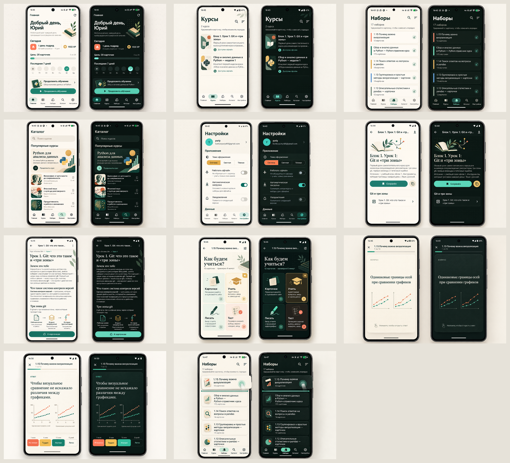

# Редизайн мобильного приложения Remora

Здесь зафиксирован утверждённый визуальный концепт мобильного приложения, исходные
скриншоты и план переноса дизайна во Flutter. Концепт согласован 30 сентября 2026 года.

## Направление

Рабочее название визуальной системы — «живая тетрадь знаний». Интерфейс остаётся
Android-native и следует структуре Material 3, но получает более выраженный характер:

- светлая тема построена на тёплой бумажной основе, цвете слоновой кости и глубоком
  хвойном тексте;
- тёмная тема использует чернильно-зелёный фон, мягкий кремовый текст и отдельные
  тональные поверхности вместо простой инверсии;
- основной акцент — нефритовый или мятный, дополнительные смысловые акценты —
  коралловый и охристый;
- крупные заголовки и учебные материалы получают более редакционную типографику,
  служебные подписи остаются нейтральными и хорошо читаемыми;
- рамки и вложенные карточки используются только для настоящей группировки;
- учебное содержание, прогресс и основное действие важнее декоративных элементов;
- иллюстрации книг, листьев, карточек и связей знаний поддерживают атмосферу, но не
  заменяют информацию и не используются как самостоятельные элементы управления.

Точная палитра и роли компонентов будут перенесены в `apps/mobile/lib/app/theme.dart`.
Утверждённый мастер-логотип Remora и его геометрия не меняются.

## Что сохранено

- [`baseline`](baseline) — скриншоты текущего приложения на Pixel 7 Pro до редизайна;
- [`concepts`](concepts) — полноразмерные концепты светлой и тёмной тем;
- [`plan.md`](plan.md) — порядок реализации и критерии готовности каждого экрана.

## Карта экранов

| Экран или состояние | До | Утверждённый концепт | Основной Flutter-файл |
|---|---|---|---|
| Главная | [скриншот](baseline/01-home.png) | [светлая и тёмная темы](concepts/01-home-light-dark.png) | `features/dashboard/dashboard_screen.dart` |
| Курсы | [скриншот](baseline/02-courses.png) | [светлая и тёмная темы](concepts/02-courses-light-dark.png) | `features/courses/courses_screen.dart` |
| Наборы | [скриншот](baseline/03-sets.png) | [светлая и тёмная темы](concepts/03-sets-light-dark.png) | `features/library/library_screen.dart` |
| Каталог | [скриншот](baseline/04-catalog.png) | [светлая и тёмная темы](concepts/04-catalog-light-dark.png) | `features/catalog/catalog_screen.dart` |
| Настройки | [скриншот](baseline/05-settings.png) | [светлая и тёмная темы](concepts/05-settings-light-dark.png) | `app/home_screen.dart` |
| Страница курса | [скриншот](baseline/06-course-detail.png) | [светлая и тёмная темы](concepts/06-course-detail-light-dark.png) | `features/courses/course_detail_screen.dart` |
| Статья | [скриншот](baseline/07-article.png) | [светлая и тёмная темы](concepts/07-article-light-dark.png) | `features/courses/article_screen.dart` |
| Выбор режима | [скриншот](baseline/08-study-modes.png) | [светлая и тёмная темы](concepts/08-study-modes-light-dark.png) | `features/study/study_setup_screen.dart` |
| Вопрос карточки | [скриншот](baseline/09-flashcard-front.png) | [светлая и тёмная темы](concepts/09-flashcard-question-light-dark.png) | `features/study/flashcards_screen.dart` |
| Ответ карточки | [скриншот](baseline/10-flashcard-back.png) | [светлая и тёмная темы](concepts/10-flashcard-answer-light-dark.png) | `features/study/flashcards_screen.dart` |
| Перетаскивание | [скриншот](baseline/11-set-drag-state.png) | [светлая и тёмная темы](concepts/11-drag-state-light-dark.png) | `features/library/list_sort.dart` |

Концепты задают композицию, визуальную иерархию, цветовые роли и характер. Тексты,
счётчики и иллюстрации на них могут быть демонстрационными; реализация обязана использовать
реальные данные, существующие состояния и утверждённые продуктовые формулировки.

## Неприкосновенные ограничения

- не менять API, офлайн-хранилище, FSRS и логику обучения ради визуального совпадения;
- сохранить ручной порядок курсов и наборов, долгий тап по всей карточке, тактильный
  отклик и семантическое перемещение для accessibility;
- сохранить системную, светлую и тёмную настройки темы;
- обеспечить цели нажатия не меньше 48 dp и работу при масштабе шрифта 1,3;
- не перерисовывать мастер-логотип и брендовые экспорты вручную;
- новые цвета и размеры задавать семантическими токенами, а не локальными hex-значениями.
